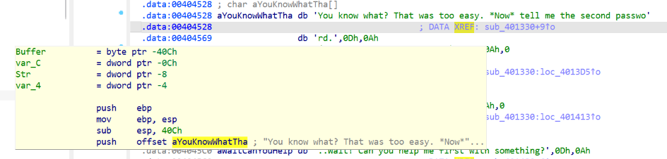
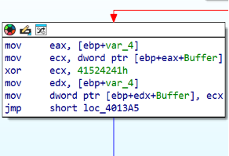
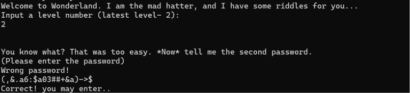

## Level 2 - 

**מטרה:** עקיפת מנגנון האימות של השלב השני בתוכנית על ידי ניתוח אלגוריתם ההצפנה.

כדי להבין מול מה אני מתמודדת, התחלתי בהרצת הקובץ `Wonderland.exe` בשורת הפקודה. כשהזנתי את השלב `2`, קיבלתי את הפלט הבא שמבקש סיסמה:

```text
You know what? That was too easy. *Now* tell me the second password.
(Please enter the password)

```

הזנת סיסמה אקראית הובילה להדפסת `Wrong password!`.

כדי להבין איך הקלט נבדק, פתחתי את הקובץ ב-IDA. התחלתי את החיפוש בחלון ה-Strings ואיתרתי את מחרוזת הפתיחה של השלב. לחיצה כפולה הובילה אותי ל-Data Segment, ומשם השתמשתי בהפניות (Xrefs) כדי לקפוץ אל הפונקציה שמשתמשת במחרוזת הזו - פונקציית האימות `sub_401330`.



בתחילת הפונקציה, זיהיתי קריאה שקולטת נתונים מהמשתמש ושומרת אותם לתוך משתנה מקומי (Buffer). מיד לאחר מכן, מתחילה לולאת העיבוד המרכזית:

התבוננות בלולאה חושפת את מנגנון ההצפנה. התוכנית לא מעבדת את הקלט תו-אחר-תו. במקום זאת, ההוראה `mov ecx, dword ptr [ebp+eax+Buffer]` שולפת בלוקים של 4 בתים (DWORD) מתוך ה-Buffer אל האוגר `ecx`.
לאחר מכן, מופעלת הפקודה: `xor ecx, 41524241h`.



מכיוון שארכיטקטורת x86 שומרת נתונים בזיכרון בשיטת Little Endian, הערך הקבוע `41524241h` נקרא מהסוף להתחלה כ-`41 42 52 41`. תרגום ערכי ההקסדצימל האלו לתווי ASCII חושף את מפתח ההצפנה המחזורי שלנו: **"ABRA"**.

בסיום לולאת ה-XOR, הפונקציה קוראת ל-`strncmp` כדי להשוות את ה-Buffer המעובד שלנו מול מחרוזת יעד קבועה השמורה בזיכרון: `"into the rabbit hole"`.

**פסאודו-קוד של הלוגיקה:**

<div dir="ltr" align="left">

```text
key = "ABRA"
for (i = 0; i < len(input); i+=4):
    input[i:i+4] = input[i:i+4] ^ key

if (input == "into the rabbit hole"):
    print("Correct! you may enter..")

```
</div>

**פיצוח:**
מכיוון שפעולת XOR מול אותו מפתח מבטלת את עצמה (Involution), הפעלתי סקריפט Python שלוקח את מחרוזת היעד ומבצע עליה XOR מול המפתח "ABRA" כדי לשחזר את הקלט המקורי הנדרש.

**סקריפט Python:**

<div dir="ltr" align="left">

```python
target = "into the rabbit hole"
key = "ABRA"
flag = ""

for i in range(len(target)):
    char_xor = ord(target[i]) ^ ord(key[i % 4])
    flag += chr(char_xor)

print(f"The exact input required is: {flag}")

```
</div>

**תוצאה:** הסיסמה המחושבת היא <span dir="ltr">`(,&.a6:$a03##+&a)->$`</span>. הזנת הסיסמה בתוכנית החזירה אימות מוצלח.



