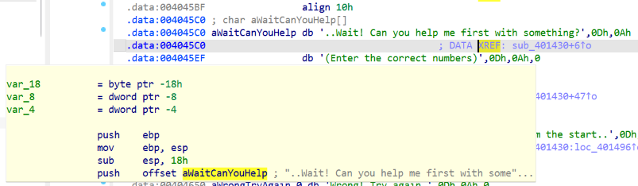
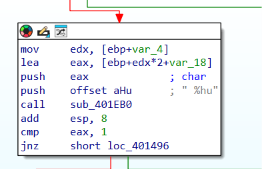
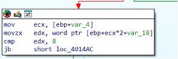
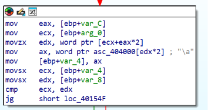
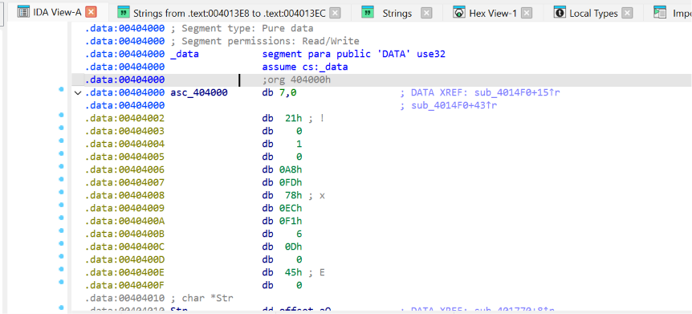
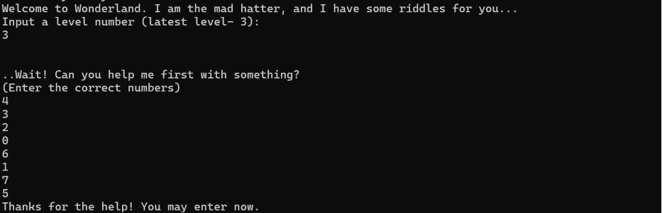

## Level 3 - 

**מטרה:** ניתוח פונקציית אימות המתבססת על שליפת נתונים ממערך סמוי, במטרה למצוא את רצף המספרים הנכון לעקיפתה.

המשכתי לשלב הבא. הפעם, התוכנית הדפיסה בקשה שונה לחלוטין:

```text
..Wait! Can you help me first with something?
(Enter the correct numbers)

```

שוב השתמשתי בחלון ה-Strings ב-IDA כדי לאתר את המחרוזת, ודרכה הגעתי לפונקציית הקלט `sub_401430`.



במקום לחפש קריאה ל-`fgets` כמו בשלב הקודם, הפעם זיהיתי לולאה שמשתמשת ב-`scanf` עם תבנית העיצוב `"%hu"`. המשמעות היא שהתוכנית מצפה לקבל סדרה של מספרים מסוג Unsigned Short (2 בתים כל אחד). לקראת סוף הלולאה, מצאתי את הפקודות `cmp edx, 8` ולאחריה `jb` (Jump if Below). זוהי בדיקת גבולות שמוודאת שהמשתמש הזין בדיוק 8 אינדקסים חוקיים, בטווח שבין 0 ל-7.




לאחר קליטת 8 המספרים אל תוך מערך, התוכנית מבצעת קריאה (`call`) לפונקציה נפרדת, `sub_4014F0`, שמתפקדת כ"שופט" (Judge).

נכנסתי לפונקציית ה"שופט" וניתחתי את הלוגיקה שלה. הפונקציה עוברת על כל אחד מ-8 המספרים שהזנו, ומשתמשת בהם כ**אינדקסים** לגישה למערך נתונים סמוי (Data Array) שנמצא בזיכרון בכתובת `404000`.
פעולת השליפה: `movsx ecx, word ptr asc_404000[eax*2]`.
השימוש בפקודת `movsx` (Move with Sign-Extension) הוא רמז קריטי – הוא מעיד על כך שהנתונים השמורים במערך הם מספרים חתומים (Signed) המיוצגים בשיטת המשלים ל-2.



מיד לאחר השליפה, מתבצעת הפקודה `cmp ecx, edx` כדי להשוות את הערך החדש שנשלף לערך שנשלף באיטרציה הקודמת, ולאחריה `jg` (Jump if Greater). אם הערך הנוכחי קטן מהקודם, הלולאה נשברת והאימות נכשל. מכאן הסקתי שהשופט יאשר את הקלט רק אם הערכים שיישלפו מהמערך הסמוי ייצרו סדרה **מונוטונית עולה**.

**אזור ה- Data Extraction:**
כדי להרכיב את רצף האינדקסים הנכון, קפצתי לחלון ה-Hex View בכתובת `404000` כדי לחלץ את המערך.



חילצתי את 8 האיברים (Word = 2 Bytes), המרתי אותם מ-Little Endian, והתייחסתי לסיבית הסימן כפי שהורתה פקודת ה-movsx. התקבל המערך הבא:
<span dir="ltr">`[7, 33, 1, -600, -5000, 1777, 13, 69]`</span>

**פסאודו-קוד של פונקציית ה-Judge:**

<div dir="ltr" align="left">

```text
secret_array = [7, 33, 1, -600, -5000, 1777, 13, 69]
prev_val = secret_array[input[0]]

for i from 1 to 7:
    curr_val = secret_array[input[i]]
    if curr_val < prev_val:
        return FAIL
    prev_val = curr_val

return SUCCESS

```
</div>

**פיצוח:**
כדי שהנתונים יישלפו בסדר עולה מהקטן ביותר (-5000) לגדול ביותר (1777), כתבתי סקריפט פייתון שקורא את המערך המקורי, ממיין אותו לפי הערכים, ומחזיר את האינדקסים המקוריים לפי הסדר הממוין.

**סקריפט Python:**

<div dir="ltr" align="left">

```python
secret = [7, 33, 1, -600, -5000, 1777, 13, 69]

# Map each value to its original index, then sort by value
indexed_array = [(val, idx) for idx, val in enumerate(secret)]
indexed_array.sort(key=lambda x: x[0])

solution = [idx for val, idx in indexed_array]
print(f"The required index sequence is: {solution}")

```
</div>

**תוצאה:** סדר האינדקסים הנדרש הוא (מימין לשמאל): `4, 3, 2, 0, 6, 1, 7, 5`. הזנת המספרים הובילה להודעת הניצחון.


