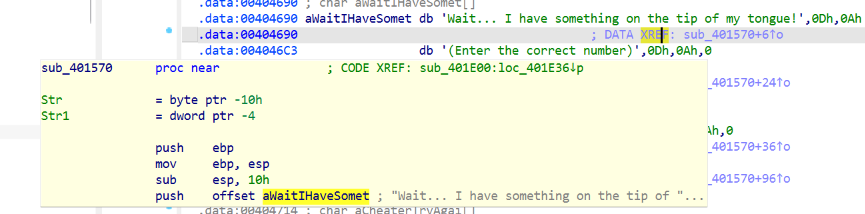
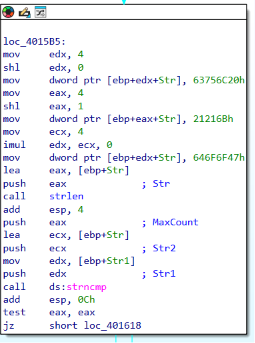
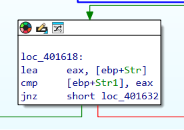
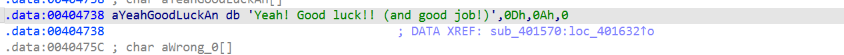
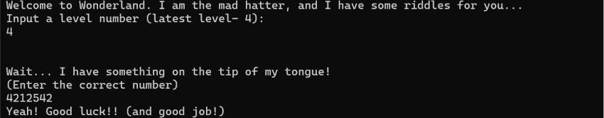

## Level 4 - 

**מטרה:** עקיפת מנגנון אימות מבוסס מצביעים ובדיקת "אי רמאות".

עם המעבר לשלב 4, התוכנית הציגה את הודעת הפתיחה הבאה שדרשה קלט מספרי:

<div dir="ltr" align="left">

```text
Wait... I have something on the tip of my tongue!
(Enter the correct number)


```

</div>

חיפשתי את המחרוזת הזו בחלון ה-Strings ב-IDA וקפצתי אל פונקציית האימות `sub_401570`.



בתחילת הפונקציה ראיתי קריאה ל-scanf שקולטת מספר שלם מהמשתמש לתוך המשתנה המקומי Str1. מיד לאחר מכן, התוכנית עוברת לבלוק קוד שמטרתו לבנות מחרוזת יעד בתוך החוצץ המקומי Str. במקום להעתיק מחרוזת מוכנה, התוכנית מציבה ערכים קשיחים בגודל של 4 בתים ישירות לתוך הזיכרון של המחסנית.

כדי להקשות על הניתוח, הבנייה מתבצעת שלא לפי הסדר הלוגי תוך שימוש בפקודות הזזה בינאריות (`shl`) לצורך חישוב האינדקסים (Offsets) בזמן ריצה. בשלב זה יש לתרגם את ערכי ההקסדצימל שהוצבו לתווי ASCII, תוך התחשבות בארכיטקטורת ה-Little Endian ההופכת את סדר הבתים בזיכרון. התוכנית כותבת תחילה לאינדקס 4: הערך שמוכנס שם הוא <span dir="ltr">`63756C20h`</span>. ב-Little Endian זה נשמר כ-<span dir="ltr">`20 6C 75 63`</span>, שזה בדיוק התווים <span dir="ltr">`' ', 'l', 'u', 'c'`</span>. לאחר מכן, היא מחשבת את אינדקס 8: הערך שמוכנס שם הוא <span dir="ltr">`21216Bh`</span> (שזה בעצם <span dir="ltr">`0021216Bh`</span>). ב-Little Endian זה נשמר כ-<span dir="ltr">`6B 21 21 00`</span>, שזה בדיוק התווים <span dir="ltr">`'k', '!', '!', '\0'`</span>. ולבסוף, התוכנית מאפסת את החישוב כדי לכתוב לראש החוצץ (אינדקס 0): הערך שמוכנס שם הוא <span dir="ltr">`646F6F47h`</span>. ב-Little Endian זה נשמר כ-<span dir="ltr">`47 6F 6F 64`</span>, שזה בדיוק התווים <span dir="ltr">`'G', 'o', 'o', 'd'`</span>. חיבור של כל המקטעים יחד חושף שהמחרוזת החשאית (Stack String) שנבנית היא <span dir="ltr">`"Good luck!!"`</span>.



לאחר בניית המחרוזת, התוכנית מבצעת קריאה לפונקציה strncmp כדי להשוות מחרוזות. הפרמטר המעניין כאן הוא הקלט שלנו (Str1), שמועבר לפונקציה ככתובת ישירה בזיכרון (Pointer), ולא כערך רגיל. התוכנית בעצם מצפה שנספק לה כתובת בזיכרון שמכילה את המילים "Good luck!!".

עם זאת, מיד לאחר מכן מופעל מנגנון אנטי-רמאות: התוכנית טוענת את כתובת המחסנית שבה נבנתה המחרוזת לתוך eax, ומשווה אותה לקלט שסיפקנו באמצעות הפקודה cmp [ebp+Str1], eax. אם ננסה להצביע ישירות למחסנית המקומית, נזוהה כרמאים ונקבל את ההודעה "Cheater.. Try again another way.". המטרה היא למצוא את המחרוזת הזו במקום אחר לגמרי במרחב הזיכרון!



**מציאת מחרוזת חלופית (Data Extraction):**
ערכתי חיפוש נוסף ב-Data Segment של התוכנית ומצאתי את המחרוזת הבאה השמורה בכתובת `00404738`:
`"Yeah! Good luck!! (and good job!)"`



כדי שהפונקציה `strncmp` תאמת את המחרוזת, המצביע חייב לנחות בדיוק על האות `'G'`. לכן, הוספתי אופסט (Offset) של 6 בתים לכתובת ההתחלתית כדי לדלג על התווים `"Yeah! "`.
חישוב הכתובת החדשה: `00404738 + 6 = 0040473E`.

**פסאודו-קוד של הלוגיקה:**

<div dir="ltr" align="left">

```text
stack_string = "Good luck!!"
user_pointer = input() // Read as an integer address

if (strncmp(user_pointer, stack_string) == 0):
    if (user_pointer == address_of(stack_string)):
        print("Cheater.. Try again another way.")
    else:
        print("Yeah! Good luck!! (and good job!)")
else:
    print("Wrong!")


```

</div>

**פיצוח:**
פונקציית ה-`scanf` מצפה לקבל את הקלט כמספר שלם בעשרוני (Decimal). לכן, המרתי את הכתובת ההקסדצימלית המחושבת `0040473E` לבסיס עשרוני.
`0040473E (HEX) = 4212542 (DEC)`

**תוצאה:** המספר המחושב הוא `4212542`. הזנת המספר בתוכנית עקפה את מנגנון האי רמאות והחזירה הודעת ניצחון.



