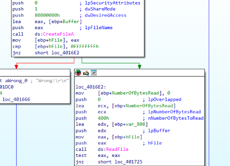
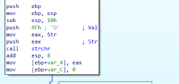
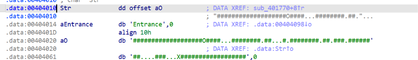
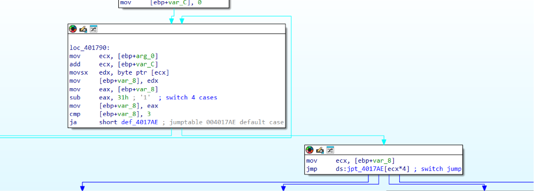
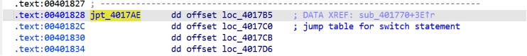
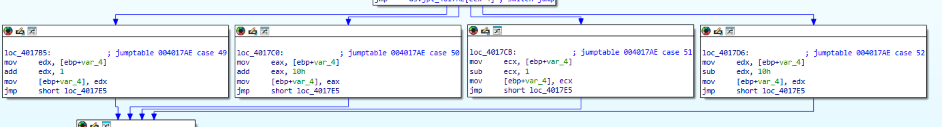
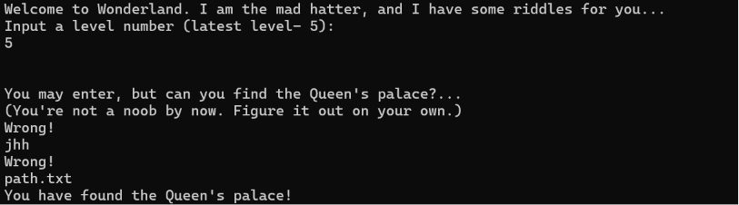

## Level 5 - 

**מטרה:** בניית אלגוריתם ניווט (מבוך) לעקיפת השלב, על ידי קריאה מקובץ חיצוני תוך ניתוח פונקציית אימות המבוססת על מכונת מצבים, וזיכרון דו ממדי באמצעות מערך חד ממדי.

עם הרצת השלב החמישי והאחרון בתוכנית, התבקשתי להזין קלט. אולם, ניתוח של פונקציית הפתיחה העלה כי אופן קבלת הקלט השתנה לחלוטין משלבים קודמים שהיו. 

במקום לעבד את המחרוזת שהזנתי ישירות כסיסמה, התוכנית העבירה את הקלט שלי לפונקציה `CreateFileA`. המשמעות הייתה שהקלט שהתוכנית מצפה לו הוא **שם של קובץ**. במידה ופתיחת הקובץ הצליחה (הוחזר Handle חוקי), התוכנית קוראת מתוכו עד `400h` בתים (1024 Bytes) בעזרת `ReadFile` אל תוך חוצץ מקומי במחסנית (Buffer בכתובת `[ebp-808h]`), סוגרת את הגישה לקובץ עם `CloseHandle`, ואז מעבירה את מצביע החוצץ המכיל את תוכן הקובץ שלי אל הפונקציה – `sub_401770`. ה"סיסמה" לשלב הזה היא בעצם תוכן הקובץ שאני צריכה לייצר.



נכנסתי לפונקציית ה"שופט" כדי להבין איזו לוגיקה מופעלת על תוכן הקובץ.

**חשיפת לוח המשחק ונקודת ההתחלה:**
הדבר הראשון שחיפשתי היה להבין מול איזה מידע הפונקציה מתמודדת. בתחילת הפונקציה זיהיתי קריאה לפונקציית הספרייה `strchr`, אשר חיפשה את התו `4Fh` (שהוא <span dir="ltr">`'O'`</span> ב-ASCII) בתוך משתנה גלובלי השמור ב-Data Segment תחת השם `Str`. 

הפונקציה החזירה מצביע למיקום המדויק שבו נמצאה האות <span dir="ltr">`'O'`</span> בתוך המחרוזת, ושמרה אותו במשתנה המקומי `[ebp+var_4]`. לכן `var_4` משמש כ**"סמן מיקום" (Player Pointer)** על גבי לוח משחק שהוגדר מראש בזיכרון, ונקודת ההתחלה שלי היא האות <span dir="ltr">`'O'`</span>.



כדי לראות את הלוח, ניגשתי לכתובת של המשתנה `Str` וחילצתי את המחרוזת השלמה:
<span dir="ltr">`"###################O####...########.##...#.########.##.###.########....###...X##################"`</span>



**לוגיקת התנועה ותעלול ה-Jump Table:**
כדי להבין כיצד אני שולטת בסמן המיקום שלי על גבי הלוח, ניתחתי את הלולאה המרכזית. התוכנית קוראת את תוכן הקובץ שלי תו אחר תו. בכל איטרציה, היא שולפת תו מהקובץ וחושפת ומפעילה`switch-case`:
תחילה, התוכנית מחסירה מהתו שנקרא את הערך `31h` (התו <span dir="ltr">`'1'`</span>), ושומרת את התוצאה ב-`[ebp+var_8]`. פעולה זו מנרמלת את הקלטים האפשריים <span dir="ltr">`'1', '2', '3', '4'`</span> למספרים הנקיים `0, 1, 2, 3`. 
לאחר בדיקת גבולות המוודאת שהקלט אינו חורג מ-3, מתבצעת פקודת הקפיצה המרכזית:
<span dir="ltr">`jmp ds:jpt_4017AE[ecx*4]`</span>



פקודה זו משתמשת בערך המנורמל מ-`var_8` (שהועבר ל-`ecx`) כאינדקס ל**טבלת קפיצות (Jump Table)** המכילה מערך של כתובות. מכיוון שמדובר בארכיטקטורת 32-ביט שבה כל כתובת בזיכרון תופסת 4 בתים, המעבד מכפיל את האינדקס שלנו ב-4 כדי לדלג אל הכתובת הנכונה בטבלה ולזנק לבלוק הפעולה המתאים לפקודה שהזנתי.




**פיענוח המטריצה הדו-ממדית (הגריד):**
בחינת 4 בלוקי הפעולות שאליהם הטבלה הפנתה הסבירה על המבנה האמיתי של לוח המשחק. הפעולות עדכנו את סמן המיקום שלי (`var_4`) באופן הבא:
* **מקרה 0 (הקלט '1'):** `add [ebp+var_4], 1` – קידום הסמן בבית אחד (תנועה **ימינה**).
* **מקרה 1 (הקלט '2'):** `add [ebp+var_4], 10h` – קידום הסמן ב-16 בתים (תנועה **למטה**).
* **מקרה 2 (הקלט '3'):** `sub [ebp+var_4], 1` – חיסור בית אחד מהסמן (תנועה **שמאלה**).
* **מקרה 3 (הקלט '4'):** `sub [ebp+var_4], 10h` – חיסור 16 בתים מהסמן (תנועה **למעלה**).



הערך `10h` (16 בעשרוני) היה את הרמז לכך שלמרות שזיכרון התוכנית הוא רציף וחד-ממדי, לוגיקת התנועה מתייחסת אליו כאל **מטריצה דו-ממדית (מבוך) שרוחב כל שורה בה הוא בדיוק 16 תווים**. הוספה או חיסור של 16 בתים שקולה לירידה או עלייה של שורה באותה עמודה בדיוק. 

על בסיס ההבנה הזו, לקחתי את המחרוזת החד-ממדית שחילצתי קודם ושברתי אותה לשורות של 16 תווים. המבוך נחשף במלואו:

<div dir="ltr" align="left">

```text
################
###O####...#####
###.##...#.#####
###.##.###.#####
###....###...X##
################

```

</div>

**חוקי הניווט ובדיקת הניצחון:**
לאחר כל עדכון של המיקום, התוכנית שולפת את התו שנמצא בכתובת החדשה של הסמן.
אם התו הוא `2Eh` (התו `'.'`), משמע הצעד חוקי והלולאה ממשיכה לקרוא את פקודת התנועה הבאה מהקובץ.
אם נחתתי על קיר (התו `'#'`) או כל תו אחר, הלולאה נשברת ומתבצעת בדיקה סופית: `cmp eax, 58h` (התו `'X'`). אם הסמן ממוקם בדיוק על `'X'` בסיום המהלכים, המשתנה `[ebp+var_10]` (דגל הניצחון) יתעדכן ל-1.

**פסאודו-קוד של לוגיקת השופט:**

<div dir="ltr" align="left">

```text
maze_ptr = find_char(maze_memory, 'O')
user_commands = read_file(input_filename)

for cmd in user_commands:
    normalized_cmd = cmd - '1'
    
    switch(normalized_cmd):
        case 0: maze_ptr += 1    // Right ('1')
        case 1: maze_ptr += 16   // Down  ('2')
        case 2: maze_ptr -= 1    // Left  ('3')
        case 3: maze_ptr -= 16   // Up    ('4')
        default: return FAIL
        
    if (*maze_ptr == '.'):
        continue
    else:
        break

if (*maze_ptr == 'X'):
    return SUCCESS
else:
    return FAIL

```
</div>

**פיצוח:**
האתגר הפך כעת לברור: לפתור את המבוך מנקודת ההתחלה `'O'` ועד ליעד `'X'`, תוך דריכה אך ורק על תווים מסוג `'.'`.
תרגמתי את מסלול ההליכה הנדרש במטריצה שחשפתי בחזרה אל מקשי השליטה:

* תנועה למטה 3 פעמים: `2 2 2`
* תנועה ימינה 3 פעמים: `1 1 1`
* תנועה למעלה פעמיים: `4 4`
* תנועה ימינה פעמיים: `1 1`
* תנועה למעלה פעם אחת: `4`
* תנועה ימינה פעמיים: `1 1`
* תנועה למטה 3 פעמים: `2 2 2`
* תנועה ימינה 3 פעמים: `1 1 1`

חיבור הרצף כולו יצר את הנתיב המושלם: `2221114411411222111`.

**תוצאה:**
יצרתי קובץ טקסט חדש בשם `path.txt` בתוך ספריית העבודה של הקובץ `Wonderland.exe`, ושמרתי בתוכו את מחרוזת הניווט. הרצתי את התוכנית, והזנתי את שם הקובץ. אלגוריתם הניווט תורגם בהצלחה על ידי מכונת המצבים, צלח את המבוך בזיכרון, והוביל אל הודעת הניצחון.


